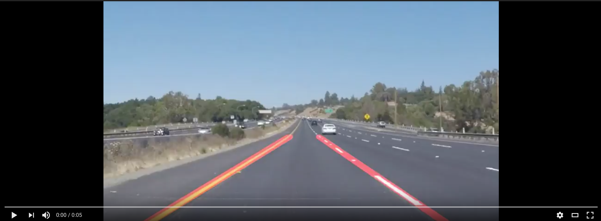

# lane-lines
This project is a detection of lane lines
### Video

This is the module 1 of Udacity Self Driving Car Nanodegree.

You can find several directories :
- examples contains the video made by Udacity instructors
- test_images contains images of my outputs
- test_videos containts videos of objectives
- test_videos_outputs contains my outputs; so what I did for the project.

To run this project, you need to have jupyter installed with Python 3.
Then simply launch P1.ipynb on a navigator and run it.

Challenge is still to complete.
